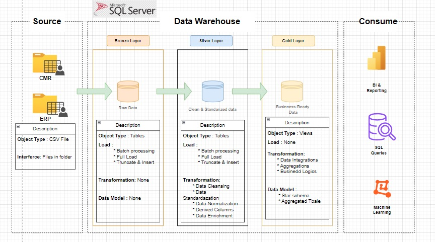

# Data Warehouse and Analytics Project

Welcome to the Data Warehouse and Analytics Project repository! 🌟 This repository showcases a complete data warehousing and analytics solution—from data warehouse construction to insightful analytics. Built as a portfolio project, it reflects industry best practices in data engineering and analytics. The data warehouse was created using SQL Server, exclusively leveraging T-SQL.

---

## Data Architecture

* Bronze Layer: Stores raw data as-is from the source systems. Data is ingested from CSV Files into SQL Server Database.
* Silver Layer: This layer includes data cleansing, standardization, and normalization processes to prepare data for analysis.
* Gold Layer: Houses business-ready data modeled into a star schema required for reporting and analytics.

---
###Project Overview

This project demonstrates my ability to design and develop a modern data warehouse using T-SQL and SQL Server, employing best practices throughout. The key components of the project include:

- **Data Architecture**: Crafting a Data Warehouse with Medallion Architecture, featuring Bronze, Silver, and Gold layers for efficient data processing.
- **ETL Pipelines**: Building robust ETL pipelines to extract, transform, and load data from various source systems into the warehouse using T-SQL.
- **Data Modeling**: Designing optimized fact and dimension tables tailored for high-performance analytical queries.
- **Analytics & Reporting**: Developing actionable insights through SQL-based reports and dashboards, providing valuable decision-making tools.

🎯 This repository highlights my expertise in the following areas:

- T-SQL Development for Data Warehousing
- Data Architecture and Design
- Data Engineering and ETL Pipeline Development
- Data Modeling for Analytical Systems
- SQL-based Analytics and Reporting

---

###Project Requirements
### Building the Data Warehouse (Data Engineering)
Objective
Develop a modern data warehouse using SQL Server to consolidate sales data, enabling analytical reporting and informed decision-making.

Specifications
Data Sources: Import data from two source systems (ERP and CRM) provided as CSV files.
Data Quality: Cleanse and resolve data quality issues prior to analysis.
Integration: Combine both sources into a single, user-friendly data model designed for analytical queries.
Scope: Focus on the latest dataset only; historization of data is not required.
Documentation: Provide clear documentation of the data model to support both business stakeholders and analytics teams.

### BI: Analytics & Reporting (Data Analysis)
Objective
Develop SQL-based analytics to deliver detailed insights into:

Customer Behavior
Product Performance
Sales Trends
These insights empower stakeholders with key business metrics, enabling strategic decision-making.

